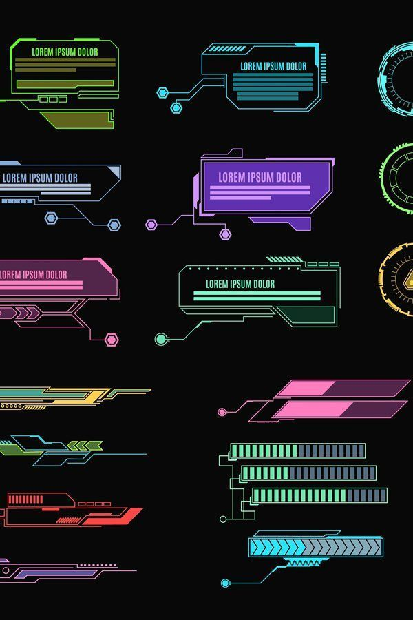
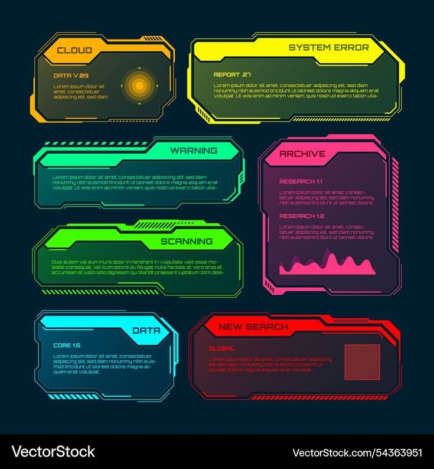
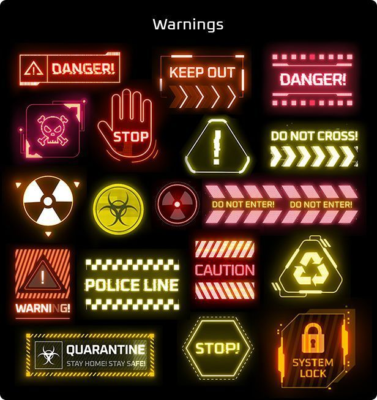
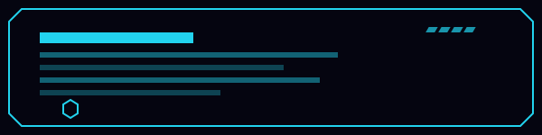
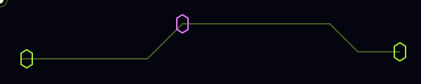

# EndoMind — Collective Conscious

A retro-futuristic 3D scroll journey: a planet trio with hoverable HUD hotspots,
a nine-card gallery carousel with scroll-driven spotlight fly-outs, and a
neon-green brain finale — wrapped in film grain, circuit traces, and liquid
glass UI. Built with React, Three.js (react-three-fiber + drei), and GSAP.

## Navigating the site

The page is one continuous scroll journey in four chapters — scroll, use
↑/↓ or PageUp/PageDown (Home/End jump to the ends), or swipe on touch:

1. **Planets** — the opening trio. Hover the glowing hotspots to preview
   each card; click (or tap) a preview to open it fullscreen.
2. **Collective Conscious** — manifesto page as the camera dives.
3. **Card gallery** — nine cards rise on a ring; keep scrolling and each
   card flies out to meet the camera in turn.
4. **The Research** — finale: a neon-green brain rising from the dark.

Around the edges: the top bar holds the negative-mode toggle and an icon
glossary; the bottom liquid-glass dock toggles background layers (stars,
circuits, grain, negative); glass orbs drift away from your cursor. In the
   card modal, ←/→ step between cards and Esc closes.

## Scripts

- `npm run dev` — local dev server with HMR
- `npm run build` — production build to `dist/`
- `npm run preview` — serve the production build locally
- `npm run lint` — ESLint over the whole repo (must be clean)

## Visual language

The dialogue bubbles, pop-ups, and HUD plates take their aesthetic from these
cyberpunk HUD reference sheets (kept in `reference/future/`):

The same motifs, alive — chamfered scan frame, traveling circuit pulse,
chevron marquee:

## Project layout

- `src/App.jsx` — thin composition root + shared UI state (layers, modal)
- `src/config/sceneConfig.js` — every magic number: planets, cards, hotspots
- `src/components/background/` — Stars, CircuitStreaks, GrainField overlays
- `src/components/ui/` — Navbar, GlassToggle, IconDemo, CardFocus, HtmlPages, ErrorBoundary
- `src/components/liquid/` — LiquidGlassDock, FleeingGlassOrbs, shared glass styles
- `src/three/` — SectorTitle, PlanetSystem, CardCarousel, GardenFinale, CloudLayer, SceneRig
- `src/hooks/` — `useMagneticPull` (cursor-lean physics)
- `src/utils/` — math, glow texture, WebGL probe
- `public/assets/`, `public/fonts/` — card textures + 3D typeface (served as-is)
- `reference/` — design inspiration and unused experiments (never bundled)

## Production notes

- Fails safe: an `ErrorBoundary` guards the Canvas (bad asset / HDR fetch
  failure degrades to a reload prompt) and a WebGL probe renders a 2D message
  where GPU rendering is unavailable.
- Zero runtime CDN dependencies: type is bundled via Fontsource and the
  environment HDR is served from `public/hdr/` — the only fetch is your own
  host, so Vercel static hosting works fully offline-capable.
- Keyboard users page the journey with ↑/↓, PageUp/PageDown, Home/End
  (`three/KeyboardScroll.jsx`); arrow keys are left to card nav in the modal.
- The Canvas lazy-loads behind a HUD boot screen: initial JS is ~26KB, the
  ~1.2MB of 3D vendor streams in after first paint.
- Vendor chunking (`three`, `react-three`, `gsap`) is configured in
  `vite.config.js` so library code caches independently of app code.
- Respects `prefers-reduced-motion` across all 2D and 3D animation.
